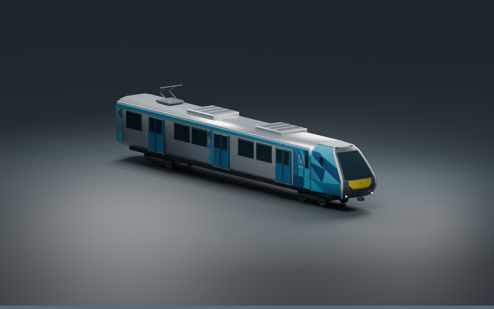

# Melbourne Rail Explorer

A desktop-browser train-driving prototype through Melbourne's City Loop. Take the driver's seat, work the throttle and brakes, stop at platforms, board passengers, and complete a circuit.



*Original Blender asset based on Melbourne HCMT photographic reference. This is a game recreation, not manufacturer CAD.*

```sh
npm install
npm run dev
```

Open the local URL printed by Vite. A WebGPU-capable browser and GPU are required. `npm run build` creates a static site in `dist/`.

## Graphics

The renderer uses Three.js's native WebGPU backend, with TSL height-aware haze and animated Yarra water normals. Shadows, antialiasing and the current high-quality lighting are always enabled. The train simulation, controls and saves remain independent of the renderer. Start stays disabled until graphics, assets and initial material compilation finish. If WebGPU cannot initialize, the game shows an error and leaves the service unavailable.

There is no WebGL rendering path or reduced-quality mode. The production build rejects inclusion of Three.js's WebGL fallback backend. Development builds expose the backend and frame statistics on the canvas dataset; `/?view=river&scene=departure` selects a water inspection camera. The Flinders Street–Southern Cross corridor combines official map geometry, mapped vegetation, PBR surfaces and an instanced Blender viaduct with distance-based detail.

## Controls

| Input | Action |
|---|---|
| W / Up | Move controller toward power |
| S / Down | Move controller toward braking |
| D | Open / close doors |
| Space | Emergency brake |
| C | Cab / exterior camera |
| M | Route map |
| H | Horn (enable sound first) |
| Escape | Pause / resume |

The controller has four brake notches, coast, and four power notches. Stop within eight metres of the station marker to open doors. Boarding takes eight seconds. Doors lock out traction. Pausing or leaving the tab saves progress locally; a new visit offers Continue saved service. No account or API key is needed for the included offline dataset.

## What is geographically grounded

- 8,533 measured building sections from City of Melbourne's **2023 Building Footprints** dataset, cropped to the CBD. The source contains capture dates including 2018; the dataset name is not a guarantee of contemporary scenery.
- Projected local metre coordinates anchored near Flinders Street, with measured building footprints, vertical offsets, and extrusion heights.
- Official Transport Victoria route shape legs and station coordinates, assembled into a continuous five-station training circuit.
- The Yarra's variable-width water boundary from Victoria's Vicmap Hydro dataset, including the central-city banks.
- 804 official Vicmap road/path/bridge segments and 188 rail/tram segments in the western corridor, with surface tram alignments rendered.
- 3,100 City of Melbourne tree locations and 40 official open-space parcels; selected park parcels provide grass areas. Tree shapes and road widths are authored, not measured.

## Prototype boundaries

The horizontal railway is derived from **official Transport Victoria route shapes**, joined into a training circuit; elevations, junction transition and closure are authored. It is not surveyed track. The single playable training circuit is Flinders Street → Southern Cross → Flagstaff → Melbourne Central → Parliament → Flinders Street. It does not model all four actual City Loop tunnels or represent a particular current timetable.

The seven-car HCMT exterior is recreated in Blender from photographic reference, with animated doors and an editable source file. Flinders Street has an authored heritage façade; Southern Cross has its characteristic wave roof. The PT-inspired interface uses navy, blue and white wayfinding, with local system fonts.

Building outlines, heights and river boundaries use real data, but this is **not yet a photorealistic recreation**. Building façades, station interiors, ground elevations, road widths, bridge approaches, tree sizes, river level and bank structures, gradients and cab controls remain approximations. Roads and mapped vegetation use official horizontal locations. Water reflects the sky environment; it does not yet mirror nearby buildings. No accurate signalling, switches, operational safety systems, live trains, or collisions with other trains are claimed. Train braking and acceleration are deliberately approachable and are not fleet-calibrated.

See [architecture](docs/architecture.md) for the Void Explorer-inspired boundaries and the realistic-asset integration path, and [sources](docs/sources.md) for provenance and attribution.

## Validation

```sh
npm test              # Physics, interlocks, station service, save validation, route continuity
npm run test:browser  # Installed Google Chrome; launch, keyboard controls, save, screenshots
npm run build        # Strict TypeScript + production bundle
```

The automated browser harness is optional and uses installed Chrome. Final interactive visual verification is performed in the Codex in-app browser. Browser screenshots are written to ignored `artifacts/`; frame timings are environment-specific, not a hardware performance guarantee.

Development builds expose `window.__RAIL_EXPLORER__` with `state()`, `metrics()`, `scenario(name)`, and validated `restore(state)`. Named scenarios: `departure`, `viaduct`, `approach`, `tunnel`, `platform`. Scenario runs do not overwrite saved services. `/?scene=viaduct&view=viaduct` reviews the railway from the river bank; `/?scene=viaduct` reviews the cab. Alternatively open `/?scene=tunnel` in the development server. Debug hooks and query-driven scenarios are not exposed in production.

## Refreshing building data

The runtime ships the compact, attributed `public/data/buildings.json` snapshot (approximately 2.8 MB). To regenerate it, download the official CBD export to `public/data/buildings-raw.json`, then run `node scripts/prepare-city.mjs`. Raw exports are excluded from Git and are not needed to play. The precise query and source are in `docs/sources.md`.

## Design and assets

- [Adapted prompts and article implementation approach](docs/prompt-playbook.md)
- [Blender HCMT source and export pipeline](docs/train-assets.md)
- [Blender viaduct kit, references and rebuild](docs/viaduct-assets.md)
- [Corridor geography and data refresh](docs/corridor-data.md)
- [Environment fidelity review](docs/corridor-review.md)
- [Ready-made Melbourne model research](docs/model-research.md)
- [Melbourne PT style references](docs/ui-brand-references.md)

Independent fan-made training simulator. Not affiliated with or endorsed by Metro Trains Melbourne, PTV or Transport Victoria. Source access does not grant rights to third-party marks; dataset and HDRI attribution is recorded in [sources](docs/sources.md).
