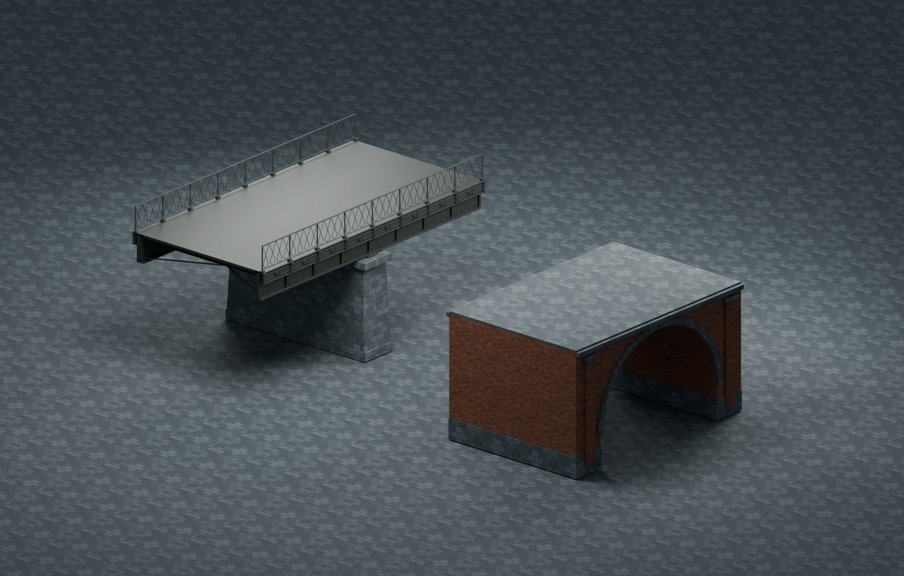

# Flinders Street railway viaduct modular kit

Original Blender-authored structural modules for the Flinders Street–Southern Cross corridor. This kit targets the **Flinders Street railway viaduct**, not Sandridge Bridge across the Yarra. It is a source-informed visual reconstruction with authored dimensions, not a surveyed replica.



## Primary visual evidence

- [McElligotts: Flinders Street Viaducts restoration](https://www.mcelligotts.com.au/projects/flinders-street-viaducts-melbourne-cbd/). The contractor documents steel refurbishment and replacement of heritage fascia, a roughly 760m old viaduct and spans of 10–24m. Its [underside photograph](https://mcelligotts.wpenginepowered.com/wp-content/uploads/2020/08/FlindersStreetViaduct-2.jpg) and [restored fascia photograph](https://mcelligotts.wpenginepowered.com/wp-content/uploads/2020/08/FlindersStreetFascia2.jpg) were inspected. The model follows their riveted transverse beams, embossed rectangular fascia panels, circular bosses, short fluted posts and delicate crossed-loop railing. Coating wear and corrosion are deliberately restrained.
- [Melbourne Maritime Heritage Network: Banana Alley](https://mmhn.org.au/heritage-trails/northbank/stop6/). The credited Jeff Malley 2022 photograph and the institution's historical account were inspected. They document brick vault shops at the eastern end. The photograph shows **enclosed rectangular shopfronts**, not an exposed repeating arch arcade. `masonry_arch_bay` represents structural vault/pier character; it is not a faithful recreation of the current Banana Alley street facade. A close street-facing reconstruction needs an additional closed frontage with shop openings and cream cornice.

Reference photographs were downloaded only to temporary storage for inspection. None are included in the GLB, source Blender file, or repository. All geometry and texture pixels are generated by the included script.

## Integration contract

All shipping roots sit at the same origin. Select a root by name; **do not add the entire GLB scene**, since the modules intentionally overlap at origin. Units are metres, exported Three.js axes are Y-up with track direction along Z. X is transverse to the tracks. Railhead datum is Y=0. No rails, sleepers, catenary or ballast are included.

| Root | Dimensions and pivot | Intended use |
|---|---|---|
| `masonry_arch_bay` | Repeat length Z=12m; nominal width X=8m (mouldings extend to about 8.3m); base Y=-6.8m; deck top Y=-0.22m | Eastern vault/abutment structural kit. Arch opening is along X, with its curved profile in Y/Z. |
| `riveted_girder_span` | Z=16m, X≈8.2m including relief; steel deck top Y=-0.22m; lower flange Y=-1.70m; handrail top Y≈1.16m | Detailed steel bridge span near the camera. |
| `bluestone_pier` | X=8.8m, Z=2m, base Y=-6.8m; stone cap top Y=-1.75m and bearing top Y=-1.67m | Transverse support below a span join. Root remains at rail datum; height can be adapted to local ground. |
| `low_detail` | Same 16m span and 8m deck envelope, matching girder/railing height | Farther spans; plain web/flanges/deck/posts, with no rivets, fascia bosses or loop rails. |

`riveted_girder_span` contains named child groups `fascia_left`, `fascia_right`, `railing_left`, and `railing_right`. Left means X<0 and right means X>0. Exclude **both railing and fascia groups on internal edges** when placing parallel two-track strips. The low-detail equivalent groups are `low_detail_railing_left` and `low_detail_railing_right`. Railing centres sit at X=±3.99m, outside a two-track envelope with track centres approximately X=±2m.

Each module or optional group is batched into one mesh per material. Mesh names follow `<group>__<material>`. They are suitable for `InstancedMesh`; retain material textures and use each source mesh's complete local/world transform when constructing instance matrices. Position quantization may add mesh transforms during optimization, so assuming identity mesh transforms is unsafe.

Use detailed girders only near the camera (suggestion: within 180m), and `low_detail` beyond that. Route chunking/frustum culling and an appropriate far cutoff remain the integrator's responsibility. Instancing reduces draw calls but does not eliminate triangle processing.

## Materials, export and rebuild

Three shared PBR materials: aged red brick, coursed Melbourne bluestone and protective-coated heritage iron. Base colour and normal images are baked directly by deterministic Python/NumPy generation and packed into the source `.blend`; no proprietary or external texture inputs are used. UVs carry metre-scale mapping with repetition. Lighting is fully dynamic; no baked lightmaps. There are no collision meshes because the playable train remains spline-constrained.

```sh
/Applications/Blender.app/Contents/MacOS/Blender --background --factory-startup --python scripts/blender/build_viaduct.py
npx --yes @gltf-transform/cli@4.5.0 optimize public/models/environment/railway-viaduct.glb /tmp/railway-viaduct-optimized.glb --compress quantize --flatten false --join false --instance false --palette false --simplify-error 0.001 --texture-compress webp --texture-size 512
cp /tmp/railway-viaduct-optimized.glb public/models/environment/railway-viaduct.glb
```

Blender 5.2.2 source: `assets/source/environment/railway-viaduct.blend`. The source scene arranges modules apart for review **after** export; rerun the generator to reproduce origin-centred shipping modules. Blender review render is written to `/tmp/railway-viaduct-review.png`. Optimization uses standard glTF quantization and WebP texture support, without a Draco/Meshopt decoder. Named roots and optional groups are retained.

## Verification

The review render was compared with the cited contractor photographs for the ornamental fascia/railing and with the heritage photograph for masonry character. The first render exposed a Blender default UV-layer issue; it was corrected so physical-scale brick/block mapping is actually used. Exact topology, material/texture budgets and low-detail triangle counts are checked from the final GLB below. This asset review does not establish integrated route placement, ground intersection, or browser frame rate.

Final optimized GLB: **1,351,588 bytes**, 12 meshes, 3 shared materials, six embedded authored image maps.

- `bluestone_pier`: 144 triangles, including optional child groups.
- `low_detail`: 348 triangles, including optional child groups.
- `masonry_arch_bay`: 1,480 triangles, including optional child groups.
- `riveted_girder_span`: 22,032 triangles, including optional child groups.

Required GLB extensions: `EXT_texture_webp`, `KHR_mesh_quantization`. No geometry decoder is required. Fine bevel detail was conservatively simplified for the shipping mesh; the editable source retains full authoring detail.

The final optimized GLB was re-imported into Blender and rendered at `/tmp/railway-viaduct-shipping-review.png`. Its quantized geometry, named modules and embedded WebP base/normal maps loaded successfully; visual review retained the fascia/railing silhouette and metre-scale masonry textures.
